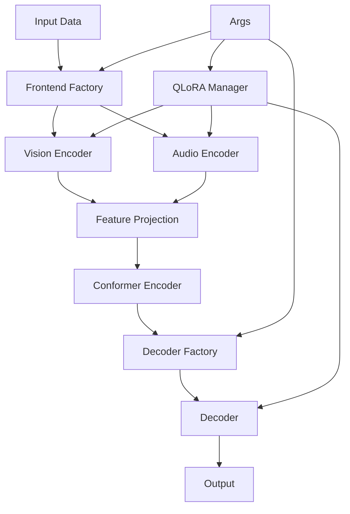

# Design Document

## Overview

This design implements a modular architecture for the Auto-AVSR system that supports multiple frontend encoders (vision and audio) and decoder types while maintaining backward compatibility. The design follows a factory pattern for component creation and includes QLoRA support for memory-efficient training of large models.

## Architecture

### High-Level Architecture



### Component Architecture

The system will be organized into several key components:

1. **Factory Classes**: Create appropriate model instances based on args
2. **Frontend Modules**: Modular vision and audio encoders
3. **Decoder Modules**: Modular decoder implementations
4. **QLoRA Manager**: Handles quantization and LoRA adapter application
5. **Feature Projection**: Automatic dimension alignment between components

## Components and Interfaces

### 1. Enhanced E2E Model

The current `E2E` model in `espnet/nets/pytorch_backend/e2e_asr_conformer.py` only supports single modality. We need to extend it to support:
- Single modality (backward compatible)
- Multimodal fusion when both vision and audio encoders are specified

### 2. Factory Classes

#### Frontend Factory (`espnet/nets/pytorch_backend/factories/frontend_factory.py`)

```python
class FrontendFactory:
    @staticmethod
    def create_vision_encoder(encoder_type: str, args) -> nn.Module
    @staticmethod
    def create_audio_encoder(encoder_type: str, args) -> nn.Module
```

#### Decoder Factory (`espnet/nets/pytorch_backend/factories/decoder_factory.py`)

```python
class DecoderFactory:
    @staticmethod
    def create_decoder(decoder_type: str, args) -> nn.Module
```

### 3. Frontend Modules

#### Base Frontend Interface (`espnet/nets/pytorch_backend/frontend/base_frontend.py`)

```python
class BaseFrontend(nn.Module):
    def __init__(self, output_dim: int):
        self.output_dim = output_dim
    
    def forward(self, x: torch.Tensor) -> torch.Tensor:
        raise NotImplementedError
    
    def get_output_dim(self) -> int:
        return self.output_dim
```

#### Vision Encoders

- **ViT Encoder** (`espnet/nets/pytorch_backend/frontend/vision/vit_encoder.py`)
  - Supports various ViT variants (ViT-B, ViT-L, ViT-H)
  - Handles video input by treating frames as patches
  - Configurable patch size and temporal pooling

- **ViViT Encoder** (`espnet/nets/pytorch_backend/frontend/vision/vivit_encoder.py`)
  - Implements Video Vision Transformer
  - Supports factorized spatial-temporal attention
  - Handles 3D video input natively

- **CLIP ViT Encoder** (`espnet/nets/pytorch_backend/frontend/vision/clip_vit_encoder.py`)
  - Uses pretrained CLIP vision encoder
  - Supports frozen and fine-tunable modes
  - Handles feature extraction from CLIP

#### Audio Encoders

- **Whisper Encoder** (`espnet/nets/pytorch_backend/frontend/audio/whisper_encoder.py`)
  - Extracts features from Whisper encoder layers
  - Supports different Whisper model sizes
  - Configurable layer extraction

- **WavLM Encoder** (`espnet/nets/pytorch_backend/frontend/audio/wavlm_encoder.py`)
  - Uses Microsoft WavLM for audio encoding
  - Supports different WavLM variants
  - Handles raw audio input

### 4. Decoder Modules

#### Base Decoder Interface (`espnet/nets/pytorch_backend/decoder/base_decoder.py`)

```python
class BaseDecoder(nn.Module):
    def forward(self, tgt, tgt_mask, memory, memory_mask):
        raise NotImplementedError
    
    def forward_one_step(self, tgt, tgt_mask, memory, memory_mask=None, cache=None):
        raise NotImplementedError
```

#### LLaMA Decoder (`espnet/nets/pytorch_backend/decoder/llama_decoder.py`)

- Integrates HuggingFace LLaMA models
- Supports LoRA fine-tuning
- Handles encoder-decoder attention adaptation
- Maintains compatibility with beam search

#### Whisper Decoder (`espnet/nets/pytorch_backend/decoder/whisper_decoder.py`)

- Uses Whisper decoder architecture
- Supports cross-attention with visual/audio features
- Maintains multilingual capabilities

### 5. QLoRA Manager

#### QLoRA Manager (`espnet/nets/pytorch_backend/lora/qlora_manager.py`)

```python
class QLoRAManager:
    def __init__(self, args):
        self.args = args
    
    def apply_qlora(self, model: nn.Module, target_modules: List[str]) -> nn.Module:
        # Apply 4-bit quantization and LoRA adapters
        pass
    
    def get_trainable_params(self, model: nn.Module) -> Iterator[nn.Parameter]:
        # Return only LoRA parameters for training
        pass
```

### 6. Feature Projection and Fusion

#### Auto Projection (`espnet/nets/pytorch_backend/projection/auto_projection.py`)

```python
class AutoProjection(nn.Module):
    def __init__(self, input_dim: int, output_dim: int):
        # Automatically creates appropriate projection layers
        pass
    
    def forward(self, x: torch.Tensor) -> torch.Tensor:
        # Projects features to target dimension
        pass
```

#### Multimodal Fusion (`espnet/nets/pytorch_backend/fusion/multimodal_fusion.py`)

```python
class MultimodalFusion(nn.Module):
    def __init__(self, vision_dim: int, audio_dim: int, output_dim: int, fusion_type: str = "concat"):
        # Supports different fusion strategies: concat, add, attention-based
        pass
    
    def forward(self, vision_features: torch.Tensor, audio_features: torch.Tensor) -> torch.Tensor:
        # Fuses vision and audio features
        pass
```

## Data Models

### Extended Arguments

The existing argparse system in `train.py` will be extended with new arguments:

```python
# New arguments to add to parse_args()
parser.add_argument("--vision-encoder", type=str, help="Vision encoder type", choices=["resnet", "vit", "vivit", "clip-vit"])
parser.add_argument("--audio-encoder", type=str, help="Audio encoder type", choices=["resnet1d", "whisper", "wavlm", "conformer"])
parser.add_argument("--decoder", default="transformer", choices=["transformer", "llama", "whisper-decoder"])
parser.add_argument("--use-qlora", action="store_true", help="Enable QLoRA training")
parser.add_argument("--qlora-r", type=int, default=16, help="LoRA rank")
parser.add_argument("--qlora-alpha", type=int, default=32, help="LoRA alpha")
parser.add_argument("--vision-model-name", type=str, help="Specific model name for vision encoder")
parser.add_argument("--audio-model-name", type=str, help="Specific model name for audio encoder")
parser.add_argument("--decoder-model-name", type=str, help="Specific model name for decoder")
```

### Modality Handling

The system will automatically determine the modality based on the encoders specified:
- If only `--vision-encoder` is specified: Use video modality
- If only `--audio-encoder` is specified: Use audio modality  
- If both are specified: Use multimodal (audio-visual) fusion
- The existing `--modality` argument will be deprecated but maintained for backward compatibility

### Model Registry

```python
MODEL_REGISTRY = {
    "vision_encoders": {
        "resnet": {"class": Conv3dResNet, "output_dim": 512},
        "vit": {"class": ViTEncoder, "output_dim": 768},
        "vivit": {"class": ViViTEncoder, "output_dim": 768},
        "clip-vit": {"class": CLIPViTEncoder, "output_dim": 768},
    },
    "audio_encoders": {
        "resnet1d": {"class": AudioResNet, "output_dim": 512},
        "whisper": {"class": WhisperEncoder, "output_dim": 1024},
        "wavlm": {"class": WavLMEncoder, "output_dim": 768},
    },
    "decoders": {
        "transformer": {"class": TransformerDecoder},
        "llama": {"class": LLaMADecoder},
        "whisper-decoder": {"class": WhisperDecoder},
    }
}
```

## Error Handling

### Configuration Validation

1. **Invalid Model Combinations**: Check compatibility between encoders and decoders
2. **Missing Dependencies**: Verify required packages are installed (transformers, peft, bitsandbytes)
3. **Hardware Requirements**: Check GPU memory for large models
4. **Checkpoint Compatibility**: Validate checkpoint architecture matches current config

### Runtime Error Handling

1. **Memory Errors**: Automatic fallback to smaller models or QLoRA
2. **Dimension Mismatches**: Automatic projection layer insertion
3. **Model Loading Errors**: Clear error messages with suggested fixes

## Testing Strategy

### Unit Tests

1. **Factory Tests**: Verify correct model instantiation for all configurations
2. **Frontend Tests**: Test each encoder with sample inputs
3. **Decoder Tests**: Test each decoder with sample encoder outputs
4. **QLoRA Tests**: Verify quantization and LoRA application
5. **Projection Tests**: Test automatic dimension alignment

### Integration Tests

1. **End-to-End Tests**: Test complete training pipeline with different model combinations
2. **Checkpoint Tests**: Verify saving and loading of different model types
3. **Memory Tests**: Verify QLoRA reduces memory usage as expected
4. **Backward Compatibility Tests**: Ensure existing models still work

### Performance Tests

1. **Speed Benchmarks**: Compare training/inference speed across configurations
2. **Memory Benchmarks**: Measure memory usage with and without QLoRA
3. **Accuracy Tests**: Verify model combinations achieve expected performance

## Implementation Phases

### Phase 1: Core Infrastructure
- Factory classes and base interfaces
- Configuration system and model registry
- Basic projection layers

### Phase 2: Frontend Modules
- ViT and ViViT vision encoders
- Whisper and WavLM audio encoders
- Integration with existing ResNet encoders

### Phase 3: Decoder Modules
- LLaMA decoder integration
- Whisper decoder integration
- Compatibility with existing transformer decoder

### Phase 4: QLoRA Integration
- QLoRA manager implementation
- Integration with all model types
- Memory optimization and testing

### Phase 5: Testing and Optimization
- Comprehensive test suite
- Performance optimization
- Documentation and examples

## Backward Compatibility

The design maintains full backward compatibility by:

1. **Default Configuration**: Using existing ResNet + Transformer as default
2. **Checkpoint Loading**: Automatic detection of legacy checkpoint format
3. **API Compatibility**: Maintaining existing training script interface
4. **Gradual Migration**: Allowing incremental adoption of new features

## Dependencies

### New Dependencies
- `transformers`: For HuggingFace models (ViT, LLaMA, Whisper)
- `peft`: For LoRA implementation
- `bitsandbytes`: For 4-bit quantization
- `timm`: For additional vision models

### Optional Dependencies
- `flash-attn`: For memory-efficient attention (if available)
- `xformers`: For optimized transformers (if available)

## Configuration Examples

### ViT + LLaMA Configuration (Video Only)
```bash
python train.py --vision-encoder vit --decoder llama --use-qlora \
                --vision-model-name google/vit-base-patch16-224 \
                --decoder-model-name meta-llama/Llama-2-7b-hf \
                --exp-dir ./exp --exp-name vit-llama-experiment \
                --root-dir /path/to/data --train-file train.csv
```

### Whisper + Whisper Configuration (Audio Only)
```bash
python train.py --audio-encoder whisper --decoder whisper-decoder \
                --audio-model-name openai/whisper-base \
                --decoder-model-name openai/whisper-base \
                --exp-dir ./exp --exp-name whisper-experiment \
                --root-dir /path/to/data --train-file train.csv
```

### Mixed Audio-Visual Configuration with QLoRA
```bash
python train.py --vision-encoder clip-vit --audio-encoder wavlm --decoder llama --use-qlora \
                --vision-model-name openai/clip-vit-large-patch14 \
                --audio-model-name microsoft/wavlm-large \
                --decoder-model-name meta-llama/Llama-2-7b-hf \
                --exp-dir ./exp --exp-name mixed-qlora-experiment \
                --root-dir /path/to/data --train-file train.csv
```

Note: When both vision and audio encoders are specified, the system automatically uses multimodal fusion. The `--modality` argument is no longer required.